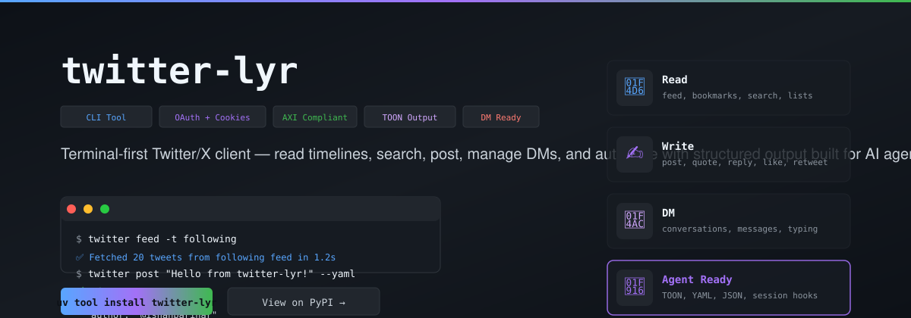

# twitter-lyr

<!-- T2I HERO SPEC — Subject: a Twitter/X data engine — a tweet bird-motif (abstract) feeding tweets, trends, and users through an HTTPX pipeline into structured JSON for agents. Composition: tweet nodes → funnel → JSON cards. Palette: X black #000000 on dark slate → sky #38bdf8 accents. Style: dark flat vector, tweet-card motif, no text. 16:9. -->

[](https://github.com/ishan-parihar/twitter-lyr/actions/workflows/ci.yml)
[](https://pypi.org/project/twitter-lyr/)
[](https://pypi.org/project/twitter-lyr/)




A terminal-first CLI for Twitter/X: read timelines, search, post, manage DMs, and automate with structured output built for AI agents.

---

## Install

```bash
# Recommended: uv tool (fast, isolated)
uv tool install twitter-lyr

# Alternative: pipx
pipx install twitter-lyr
```

Upgrade:
```bash
uv tool upgrade twitter-lyr
# or: pipx upgrade twitter-lyr
```

> **Tip:** Upgrade regularly to avoid unexpected errors from Twitter API changes.

---

## Quick Start

```bash
# Fetch home timeline (For You)
twitter feed

# Fetch Following timeline
twitter feed -t following

# Enable ranking filter explicitly
twitter feed --filter
```

---

## Features

### Read
- **Timeline**: fetch `for-you` and `following` feeds with pagination cursors
- **Bookmarks**: list saved tweets (including **bookmark folders**)
- **Search**: find tweets by keyword with Top/Latest/Photos/Videos tabs
- **Tweet detail**: view a tweet and its replies; use `show <N>` to open tweet #N from the last list output
- **Article**: fetch a Twitter Article and export as Markdown
- **List timeline**: fetch tweets from a Twitter List
- **User lookup**: fetch user profile, tweets, likes, followers, and following
- **Notifications**: fetch notifications with type filtering (mentions, likes, retweets, follows, quotes)
- **Communities**: fetch tweets from Communities, join/leave Communities
- **Polls**: create and vote on polls
- **Lists**: full CRUD for Twitter Lists (create, update, delete, members, subscriptions)
- `--full-text`: disable tweet text truncation in rich table output
- Structured output: export any data as YAML or JSON for scripting and AI agent integration
- Optional scoring filter: rank tweets by engagement weights
- Structured output contract: [SCHEMA.md](./SCHEMA.md)

> **AI Agent Tip:** Prefer `--yaml` for structured output unless a strict JSON parser is required. Non-TTY stdout defaults to YAML automatically. Use `--max` to limit results.

### Write
- **Post**: create new tweets and replies, with optional image/video attachments (up to 4 images, 1 video)
- **Quote**: quote-tweet with optional images
- **Delete**: remove your own tweets
- **Like / Unlike**: manage tweet likes
- **Retweet / Unretweet**: manage retweets
- **Bookmark**: bookmark/unbookmark (`favorite/unfavorite` kept as compatibility aliases)
- **Follow / Unfollow**: manage follows
- **Block / Unblock**: block and unblock users
- **Mute / Unmute**: mute and unmute users
- **DM**: create conversations, send messages, list conversations/messages, mark read, typing indicator, rotate encryption keys — **currently disabled** (Twitter replaced DM with E2E-encrypted XChat; see [Limitations](#limitations))
- **Polls**: create polls (2-4 options, 5 min–7 days), vote on polls
- **Lists**: create/update/delete lists, add/remove members, list members, list subscriptions
- **Communities**: join/leave communities, fetch community tweets
- Write commands also support explicit `--json` / `--yaml` output

### Auth & Anti-Detection
- **Cookie auth**: use browser cookies or environment variables
- **OAuth 1.0a / OAuth 2.0 PKCE / App-Only**: full OAuth flows for user-context and app-only access
- **Full cookie forwarding**: extracts ALL browser cookies for richer browser context
- **TLS fingerprint impersonation**: `curl_cffi` with dynamic Chrome version matching
- **`x-client-transaction-id`** header generation
- **Request timing jitter** to avoid pattern detection
- **Write operation delays** (1.5–4s random) to mitigate rate limits
- **Proxy support** via `TWITTER_PROXY` environment variable

### Media & Utilities
- **Media status**: check upload processing status for images/videos
- **Auth management**: check status, clear cookies, login via OAuth flows
- **Structured errors**: consistent error codes (`not_authenticated`, `not_found`, `invalid_input`, `rate_limited`, `api_error`)

---

## Usage

### Feed
```bash
twitter feed --max 50
twitter feed --cursor "<next-cursor-from-previous-response>"
twitter feed --full-text
twitter feed --output tweets.json
twitter feed --input tweets.json
twitter feed --json                    # Structured stdout for scripts/agents
```

### Bookmarks
```bash
twitter bookmarks
twitter bookmarks --full-text
twitter bookmarks --max 30 --yaml
```

### Search
```bash
twitter search "Claude Code"
twitter search "AI agent" -t Latest --max 50
twitter search "AI agent" --full-text
twitter search "machine learning" --yaml
twitter search "python" --from elonmusk --lang en --since 2026-01-01
twitter search --from bbc --exclude retweets --has links
twitter search "topic" -o results.json         # Save to file
twitter search "trending" --filter              # Apply ranking filter
```

### Tweet Detail (view tweet + replies)
```bash
twitter tweet 1234567890
twitter tweet 1234567890 --full-text
twitter tweet https://x.com/user/status/1234567890
```

### Open Tweet by Index from Last List Output
```bash
twitter show 2                         # Open tweet #2 from last feed/search
twitter show 2 --full-text             # Full text in reply table
twitter show 2 --json                  # Structured output
```

### Twitter Article
```bash
twitter article 1234567890
twitter article https://x.com/user/article/1234567890 --json
twitter article 1234567890 --markdown
twitter article 1234567890 --output article.md
```

### List Timeline
```bash
twitter list 1539453138322673664
twitter list 1539453138322673664 --cursor "<next-cursor-from-previous-response>"
twitter list 1539453138322673664 --full-text
```

### User
```bash
twitter user elonmusk
twitter user-posts elonmusk --max 20
twitter user-posts elonmusk --full-text
twitter user-posts elonmusk -o tweets.json
```

### Post / Interact
```bash
# Post a tweet
twitter post "Hello from twitter-lyr!"

# Post with images (up to 4)
twitter post "Check this out" -i photo1.jpg -i photo2.png

# Post with video (1 video)
twitter post "Video tweet" -v demo.mp4

# Reply
twitter reply 1234567890 "Great point!"

# Quote tweet
twitter quote 1234567890 "My take on this..."

# Delete
twitter delete 1234567890

# Like / Unlike
twitter like 1234567890
twitter unlike 1234567890

# Retweet / Undo retweet
twitter retweet 1234567890
twitter unretweet 1234567890

# Bookmark
twitter bookmark 1234567890
twitter unbookmark 1234567890

# Follow / Unfollow
twitter follow elonmusk
twitter unfollow elonmusk

# Block / Unblock
twitter block elonmusk
twitter unblock elonmusk

# Mute / Unmute
twitter mute elonmusk
twitter unmute elonmusk
```

### DM (Direct Messages)

> ⚠️ **DM is unavailable** — Twitter replaced plaintext DMs with the E2E-encrypted XChat protocol; the legacy DM GraphQL ops no longer exist. These commands return a clear `query_id_error` (see [Limitations](#limitations)).

```bash
# List conversations
twitter dm conversations

# Create conversation
twitter dm create @user1 @user2

# Send message
twitter dm send <conversation_id> "Hello!"

# View messages
twitter dm messages <conversation_id>

# Mark as read
twitter dm read <conversation_id>

# Typing indicator
twitter dm typing <conversation_id>

# Rotate encryption keys
twitter dm rotate-keys <conversation_id>
```

### Polls
```bash
# Create poll
twitter poll create "Favorite language?" "Python" "Rust" "Go" "TypeScript" --duration 1440

# Vote on poll
twitter poll vote <tweet_id> --choice 1
```

### Lists
```bash
# Create list
twitter list create "My List" --description "Curated follows" --private

# Update list
twitter list update <list_id> --name "New Name" --description "Updated" --public

# Delete list
twitter list delete <list_id>

# Members
twitter list members <list_id>
twitter list add-member <list_id> @user
twitter list remove-member <list_id> @user

# Subscriptions (lists you follow)
twitter list subscriptions
```

### Communities
```bash
# Join/leave community
twitter community join <community_id>
twitter community leave <community_id>

# Fetch community tweets
twitter community tweets <community_id> --max 50
```

### Notifications
```bash
twitter notifications --max 50
twitter notifications --type mentions
twitter notifications --type likes
```

### Media & Auth
```bash
# Check media upload status
twitter media status <media_id>

# Auth management
twitter auth status
twitter auth login --type oauth2
twitter auth logout
```

---

## Agent Integration (AXI Compliant)

twitter-lyr is designed for AI agent workflows with AXI (Agent Experience Interface) compliance:

| Feature | Description |
|---------|-------------|
| **Content-first** | `twitter` with no args shows live timeline, not help |
| **Structured output** | `--json`, `--yaml`, `--format toon` (token-efficient) |
| **Field selector** | `--fields id,author,text,likes,time` for minimal payloads |
| **Truncation control** | `--full-text` disables truncation; default 120-char in tables |
| **Pre-computed aggregates** | Filter stats show count + score range; pagination cursors included |
| **Definitive empty states** | Clear errors for empty cache, index out of range |
| **Structured errors** | Schema: `ok`, `schema_version`, `error.code`, `error.message` |
| **Exit codes** | `0` success, `1` error, `2` usage error |
| **Session hooks** | `twitter session-install --shell bash` installs shell hook for agent session start |
| **Contextual help** | `twitter help feed` shows inherited flags (`--max`, `--filter`, `--format`, `--fields`) |
| **Stdout/stderr separation** | Progress/info → stderr; structured data → stdout |

### Output Formats

```bash
# Table (default, human-readable)
twitter feed

# YAML (default for non-TTY, great for agents)
twitter feed --yaml

# JSON
twitter feed --json

# TOON (token-efficient, ~40% smaller than JSON)
twitter feed --format toon

# Compact (single-line per tweet)
twitter feed -c

# Field selector (any format)
twitter feed --fields id,author,text,likes,time --yaml
```

### Session Hooks (Agent Session Start)

```bash
# Install shell hook (bash, zsh, fish)
twitter session-install --shell bash

# After install, new shell sessions get live timeline context automatically
```

---

## Limitations

Twitter rotates its GraphQL operation IDs and silently removes retired API surfaces. Where a surface is gone, **twitter-lyr returns a structured error instead of faking success**:

| Capability | Status |
|---|---|
| Post / reply / quote / delete | 🟢 working (verified live) |
| Like, retweet, bookmark, follow, block, mute, lists, communities | 🟢 working |
| Polls create/vote | 🟢 working |
| **Direct Messages (conversations, send, read, typing, rotate-keys)** | 🔴 **DM is E2E-encrypted (XChat); the legacy DM GraphQL ops no longer exist at the API layer.** The tool surfaces a clear `query_id_error` explaining DM is unavailable rather than emitting fabricated op IDs. Implementing real DM requires the full XChat enrollment+crypto protocol — **not something the CLI can paper over.** |
| Feed / search / user / tweet detail / bookmarks / notifications / articles / lists / communities reads | 🟢 working |

Notes:

- The browser (obscura/CDP) surface for X.com renders Twitter's anti-bot "JavaScript is not available" wall, so browser-DOM automation does **not** work for Twitter — everything goes through the GraphQL API.
- The 18 test failures flagged by `pytest` are live-network smoke tests (they contact X.com), not code defects; they reproduce on an unchanged baseline.

---

## Configuration

Create `~/.config/twitter-lyr/config.yaml`:

```yaml
fetch:
  count: 25                    # Default tweets per request
filter:
  mode: score                  # off | score | keyword
  lang:
    - en
  min_score: 10
```

Environment variables:
- `TWITTER_PROXY` — proxy URL (e.g., `http://localhost:8080`)
- `OUTPUT` — default structured format: `auto`, `json`, `yaml`, `toon`, `rich`
- OAuth credentials: `TWITTER_OAUTH1_CONSUMER_KEY`, `TWITTER_OAUTH1_CONSUMER_SECRET`, `TWITTER_OAUTH2_CLIENT_ID`, `TWITTER_OAUTH2_CLIENT_SECRET`, `TWITTER_REDIRECT_URI`

---

## Development

```bash
# Install dev dependencies
uv sync --extra dev

# Lint
uv run ruff check .

# Type check
uv run mypy twitter_cli

# Test
uv run pytest -q

# Run single test
uv run pytest tests/test_cli.py::test_feed_command -v
```

CI validates: `ruff check` + `mypy` + `pytest` on Python 3.10, 3.11, 3.12.

---

## Architecture

```
twitter_cli/
├── cli.py               # Click CLI entry point, command definitions
├── client.py            # Twitter GraphQL API client (HTTP, auth, media)
├── auth.py              # Cookie extraction & OAuth flows
├── graphql.py           # GraphQL query ID resolution
├── parser.py            # Tweet/User parsing from API responses
├── models.py            # Dataclass models (Tweet, UserProfile, etc.)
├── formatter.py         # Rich table formatting
├── serialization.py     # YAML/JSON/TOON output
├── output.py            # Structured output helpers (AXI schema)
├── config.py            # Config loading
├── filter.py            # Tweet ranking/scoring
├── cache.py             # Tweet caching
├── search.py            # Search query builder
├── timeutil.py          # Time formatting
├── constants.py         # Constants (UA, headers, etc.)
├── exceptions.py        # Custom exceptions
└── __main__.py          # Module entry point
```

Key design decisions:
- **Single HTTP session** (`curl_cffi`) with Chrome TLS fingerprint
- **ClientTransaction** for `x-client-transaction-id` header
- **GraphQL query ID auto-refresh** on 404/422 with live fallback
- **Chunked media upload** (INIT → APPEND → FINALIZE → STATUS)
- **Pagination with dedup** via generic `_fetch_timeline` / `_fetch_user_list`
- **Structured output** via shared `output.py` (AXI schema v1)

---

## Related CLI Tools

This project is part of a family of agent-friendly CLI tools for social platforms:

| Tool | CLI | Repo |
|------|-----|------|
| Instagram | `instagram-lyr` | [ishan-parihar/instagram-lyr](https://github.com/ishan-parihar/instagram-lyr) |
| Reddit | `reddit-lyr` | [ishan-parihar/reddit-lyr](https://github.com/ishan-parihar/reddit-lyr) |
| LinkedIn | `linkedin-lyr` | [ishan-parihar/linkedin-lyr](https://github.com/ishan-parihar/linkedin-lyr) |
| Twitter/X | `twitter-lyr` | [ishan-parihar/twitter-lyr](https://github.com/ishan-parihar/twitter-lyr) |
| Discord | `discord` | [ishan-parihar/discord-cli](https://github.com/ishan-parihar/discord-cli) |
| Telegram | `tg` | [ishan-parihar/tg-cli](https://github.com/ishan-parihar/tg-cli) |

---

## License

MIT License — see [LICENSE](LICENSE) for details.

---

*Built for developers and AI agents who want Twitter data without the noise.*

---

## ☕ Support & Sponsorship

If you find this project useful, consider supporting ongoing development:

[](https://github.com/sponsors/ishan-parihar)
[](https://rzp.io/rzp/ishan-parihar)

Your support funds new features, releases, and infrastructure for the whole ecosystem.
